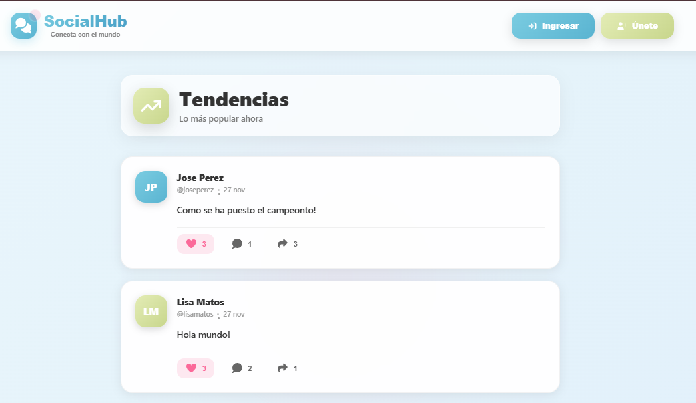

#  SocialHub - Muro Interactivo

Sistema web de red social moderno con React y Firebase. Permite a los usuarios compartir publicaciones, dar likes, comentar y conectarse con una comunidad.

### Pantalla Principal


### Login


### Registro


### Perfil


### PostCard


### Publicacion


---

##  Características

-  **Publicar** - Crea posts de hasta 500 caracteres
-  **Likes** - Da like a publicaciones sin duplicados
-  **Comentarios** - Comenta en cualquier publicación
-  **Compartir** - Comparte posts con link directo
-  **Perfil** - Ve tus estadísticas y publicaciones
-  **Eliminar** - Elimina tus posts y cuenta
-  **Diseño Moderno** - Interfaz atractiva y responsive

---

##  Tecnologías

- **React 18** + React Router
- **Firebase** (Auth + Firestore)
- **Font Awesome** - Iconos
- **CSS3** - Estilos personalizados

---

##  Instalación Rápida

```bash
# 1. Clonar repositorio
git clone https://github.com/tu-usuario/socialhub.git
cd socialhub

# 2. Instalar dependencias
npm install

# 3. Instalar Font Awesome
npm install @fortawesome/fontawesome-svg-core @fortawesome/free-solid-svg-icons @fortawesome/free-regular-svg-icons @fortawesome/react-fontawesome

# 4. Configurar Firebase (ver sección siguiente)

# 5. Iniciar
npm start
```

---

##  Configuración Firebase

### 1. Crear proyecto en [Firebase Console](https://console.firebase.google.com/)

### 2. Activar servicios:
- **Authentication** → Email/Password
- **Firestore Database** → Modo de prueba

### 3. Crear archivo `.env` en la raíz:

```env
REACT_APP_FIREBASE_API_KEY=tu-api-key
REACT_APP_FIREBASE_AUTH_DOMAIN=tu-proyecto.firebaseapp.com
REACT_APP_FIREBASE_PROJECT_ID=tu-proyecto-id
REACT_APP_FIREBASE_STORAGE_BUCKET=tu-proyecto.appspot.com
REACT_APP_FIREBASE_MESSAGING_SENDER_ID=123456789
REACT_APP_FIREBASE_APP_ID=tu-app-id
```

### 4. Configurar Reglas de Firestore:

```javascript
rules_version = '2';
service cloud.firestore {
  match /databases/{database}/documents {
    match /users/{userId} {
      allow read: if true;
      allow create: if request.auth != null;
      allow update, delete: if request.auth.uid == userId;
    }
    match /posts/{postId} {
      allow read: if true;
      allow create: if request.auth != null;
      allow update: if request.auth != null;
      allow delete: if request.auth != null 
                    && request.auth.uid == resource.data.authorId;
    }
  }
}
```


---

##  Estructura de Datos

### Colección: `users`
```javascript
{
  uid: string,
  usuario: string,
  nombre: string,
  apellido: string,
  createdAt: string
}
```

### Colección: `posts`
```javascript
{
  content: string,
  authorId: string,
  authorName: string,
  authorUsername: string,
  createdAt: string,
  likes: array<string>,
  likesCount: number,
  comments: array<object>,
  commentsCount: number,
  shares: number
}
```

---

##  Comandos Disponibles

```bash
npm start       # Iniciar desarrollo
npm build       # Build de producción
npm test        # Ejecutar tests
```

---

##  Licencia

Este proyecto está bajo la Licencia MIT.

---

##  Autor

**Katherine Matos**

---


<div align="center">

**SocialHub** © 2025

</div>